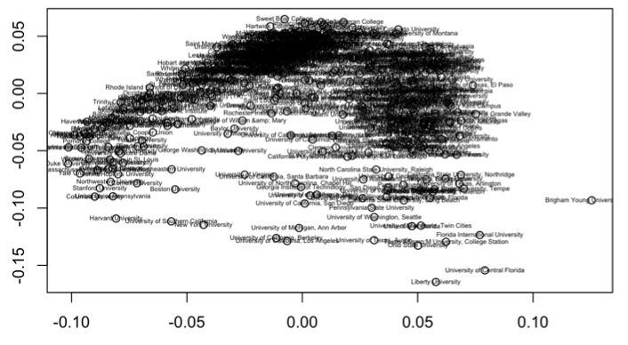
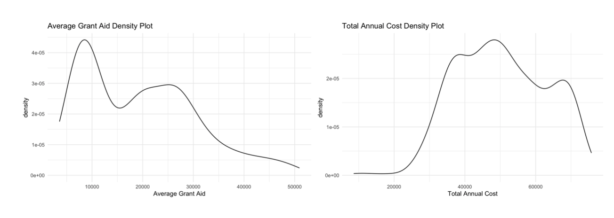
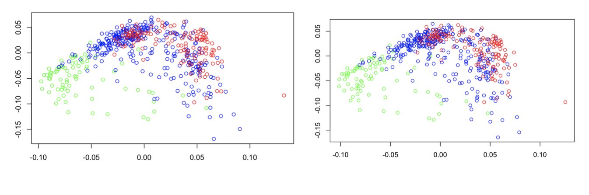
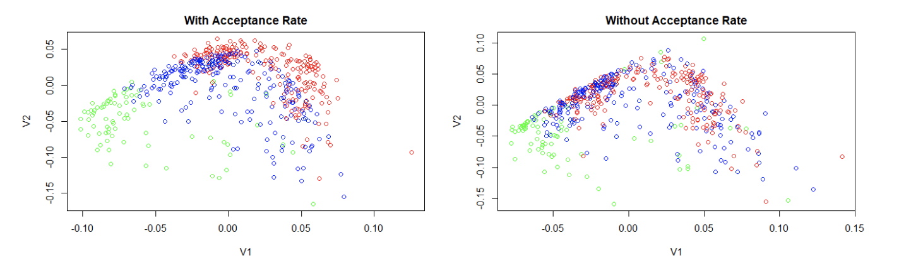
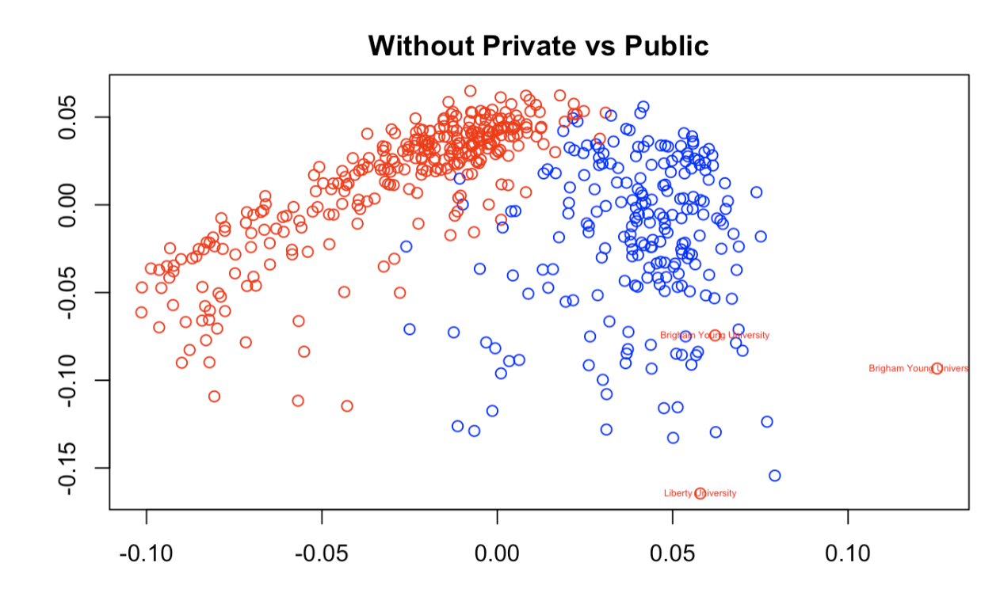

```{r setup, include=FALSE}
knitr::opts_chunk$set(echo = FALSE)
```

This past spring, two of my classmates at Macalester College (Vivian Powell and Pippa Gallagher) and I decided to use the SVD to analyze United States colleges. The SVD - Singular Value Decomposition - is a matrix factorization that can be used for data reduction in machine learning, similarity analysis, image compression, and least squares regression among other uses. In this project, we used the SVD and a data set from Forbes 2019 about “America’s Top Colleges” to identify some of America’s most unique colleges and universities, at least in the sense of some of their basic demographics.\

### General Analysis

Using a data set with the 523 colleges Forbes selected, we took information on each school's undergraduate population, student population, net price, average grant aid, total annual cost, alumni salary, acceptance rate, and mean SAT and ACT scores to build an original SVD plot. Giving each variable an equal weighing on a 0 to 1 scale, we got the following plot.\ 

{width=55%}

A first step in the analysis of the SVD plot of the entire matrix was to look at the first two left singular vectors in order to understand which variables were most strongly associated with the horizontal axis and vertical axis in the plot of the first two right singular vectors. Below is a table that displays the left singular vectors U1 and U2, and which variable each entry represents:

{width=55%}

U1 and U2, which are the two most important left singular vectors of our matrix, essentially tell us which variables are the most influential on a college’s placement in the plot of V1 and V2. By analyzing U1, we can see which colleges are going to be closest to the direction of V1 (the negative horizontal axis in our case) and which will be furthest (the positive horizontal direction). We can see that the largest positive value in U1 is for Average Grant Aid, indicating that colleges with more grant aid will be closer to the direction of V1 and colleges with less grant aid will be farther from that direction. Total Annual Cost is similarly influential, with a slightly lower positive value. The largest negative value in U1 is for Acceptance Rate, which indicates that colleges with the lowest acceptance rates will be more negative on the x-axis, while colleges with high acceptance rates will be more positive on the x-axis. Overall, this tells us that colleges closer to the left side of the plot are likely to have a higher cost, higher grant aid, and a lower acceptance rate. We can expect this to include schools like the Ivies and “prestigious” liberal arts colleges with substantial endowments. On the other hand, colleges closer to the right side of the plot are likely to have a lower cost and less aid, as well as a higher acceptance rate. We could expect to see state schools with lower tuition in this category. \

Looking at U2, which tells us which variables are the most influential in a college’s placement on the vertical axis, we see that the largest positive value is for Acceptance Rate. This means that colleges with a higher acceptance rate will tend to have more positive y values, while colleges with lower acceptance rates will tend to have more negative y values. U2 also has two very large negative values, for Student Population and Undergraduate Population. This indicates that schools with a very large number of students will tend to be closer to the negative y-axis, while schools with few students will be closer to the positive y-axis. Overall, colleges near the top of the plot are likely to have a higher acceptance rate and/or smaller student populations, and colleges near the bottom of the plot are likely to be more selective and/or have larger student populations.\

Clearly, this analysis isn’t perfect, because there will be schools with very low acceptance rates and tiny populations, and according to our analysis these schools won't have a specific place on the plot. However, the information we gain from analyzing these first two columns of U is mostly to help us understand what the main factors are for grouping colleges in this way, and why two colleges might be plotted as opposites even if they are similar in some ways. Knowing that cost, financial aid, size, and acceptance rate are the most important variables for our SVD analysis will allow us to understand what makes some of these colleges unique.\

### Outliers 

{width=55%}

In order to apply what we now know about U and V, we can look at the SVD plot and consider our outliers. Above is a plot of the SVD with labels on a few of the major outlier schools that we noticed in our analysis (BYU, University of Central Florida, and Liberty University). The major outlier we saw in almost all plots was BYU. Upon further research, we found that BYU has an incredibly low annual total cost of 18,370 dollars in comparison to almost all other universities. As a result of this, it also has a very low grant aid ($4843 annually). To really understand quite how low these numbers are in comparison to other universities, take a look at the density plots of total annual cost and grant aid below. 

{width=65%}

That’s pretty crazy! However, this information actually lines up with our SVD plots. If you remember, when we discussed singular vectors we said that colleges with more grant aid and a higher total annual cost would be much more on the negative side of the x axis and those with lower costs and financial aid would be on the right, positive side. BYU definitely follows this trend, being a huge right horizontal outlier on all of our plots. 


Now let’s see what might be going on at the University of Central Florida. Digging into the data, we found that the University of Central Florida has a large student population of 66,059 students.  Looking at the student population density plot, there appear to be hardly any schools of this size. 

{width=65%}

Additionally, UCF’s average grant aid is $5757, which we know from the density plot of average grant aid is certainly on the lower end of the spectrum. The low grant aid explains this university’s positive V1 value on the SVD plot. The university’s large student population explains why UCF is such a noticeable vertical outlier.

Finally, let’s investigate our third major outlier, Liberty University. Based on Liberty’s negative vertical location on the plot we might predict Liberty has a large student population or is a more selective university. From the positive V1 value we guess that Liberty tends to be a cheaper university and/or gives out less financial aid, though not quite to the degree as BYU or even UCF. Looking into the numbers, we find our size prediction confirmed - Liberty has the largest student population at 75,735 students! Furthermore, our cost prediction is correct as well as Liberty’s average grant aid is 10,400 dollars and their annual total cost is $38,364. Wow, our SVD plot seems pretty reliable!

### Single Variable Analysis 

#### ACT and SAT scores

After completing the original plot, we decided it would be best to start looking at different variables and assessing how they appeared on the plot. For example, we took the ACT variable and divided it into three categories - low average ACT (<24), medium average ACT (24-30), and high average ACT (30+). We then created plots with the universities colored by these groups - one plot without the ACT/SAT variables included in our main matrix (below left) and one with them included (below right). Green indicates universities with high ACT scores, blue indicates medium scores of 24-30, and red indicates low scores of less than 24. 

{width=80%}

There are subtle differences between the two plots, but you really have to look closely! This means that the ACT/SAT variable is highly correlated with another variable in the data set that was plotted originally. It makes most logical sense that this would be the acceptance rate variable, which we will analyze next. However, it is important to note that based on the somewhat distinct red, blue, and green groups in these plots, ACT score and potentially acceptance rate are pretty good indicators of what makes colleges similar and different.  

#### Acceptance Rate

Next, we analyzed Acceptance Rate, as it seems to be one of the most influential variables based on our conclusions from U1 and U2. In order to do this, we defined low acceptance rates as < 35%, medium acceptance rates as  > 35% and < 70%, and high acceptance rates as > 70%. We then repeated the same process used for SAT/ACT scores by creating two plots, both color-coded by acceptance rate: one where acceptance rate was included in the SVD, and one where it was not included. In the plots below, green represents the low acceptance rates, blue represents medium, and red represents high.

{width=80%}

The first plot, with acceptance rate, looks very similar to the plots color coded for ACT/SAT score above (which makes sense given that colleges with similar acceptance rates will likely accept students with proportionally similar scores). There is a fairly clear distinction on the plot between colleges in different categories. Consistent with our conclusions from the left singular vectors earlier, we see that colleges with the lowest acceptance rates (green) tend to be towards the left and bottom sides of the plot, while colleges with high acceptance rates (red) tend to be along the top and right sides of the plot (and medium rates fall somewhere in between). However, when acceptance rate is removed from the matrix, the clarity of this pattern collapses significantly, indicating that the data of acceptance rate cannot be accurately represented as a linear combination of the other variables in the data set. So we can conclude that as we found earlier, acceptance rate is a fairly strong tool to group similar colleges by. 

#### Public versus Private 

Finally, we chose to analyze the predictability of private vs public institutions. We did not include the private/public variable in our SVD as it held far too much weight due to being a binary variable with values of only 0 and 1. Instead, we will investigate whether other variables could accurately depict a college as private or public. In the figure below, blue represents public universities and red represents private universities. The separation between the two categories is definite with minimal mixing of red and blue near the top of the plot. This demonstrates that relying on other factors - including size, cost and acceptance rate - can fairly accurately encompass the information in the public vs private variable.

{width=65%}

There are several visible outliers on this plot, including Liberty University and Brigham Young University-Idaho. While these universities are both private, they are plotted far on the positive side of the x-axis, far from any other private colleges. As we discussed earlier, this is due to their unique qualities. This graph demonstrates that private universities are more likely to have a higher tuition cost (falling on the negative x-axis), which is a common and generally accurate stereotype of private universities. However, Liberty and BYU have uncharacteristically low tuition and therefore could not be easily recognized as a private institution without the private/public factor included. If we were to include the private/public variable we can see a significantly clearer separation of the two categories, where the outliers are even easier to spot, located between the two groups of universities. 

{width=65%}

If this graph were not color coded a viewer might assume that Liberty University and Brigham Young University are public rather than private. This emphasizes the uniqueness of the two colleges and their unpredictability. While determining if a college is more likely to be private or public appears to be easy given other variables, there will always be outliers that don't fall into the stereotypes of alike colleges. 

### Conclusion

SVD analysis is not a perfect tool, but this paper has demonstrated that it carries great value in the ability to reduce a very large data set to something plottable in two dimensions that is visually digestible to the average reader. By using only the first two right singular vectors of the data, we can extract a much simpler representation of the vast majority of the information contained in the data set, and use it to understand colleges in a way that comparing schools by a single variable at a time simply would not achieve. Overall, the SVD is a good way to draw general and overarching conclusions rather than specific and pointed ones. The SVD takes advantage of having the ability to pull from a large data set that otherwise would take far too much storage, time, and machine power to analyze.
