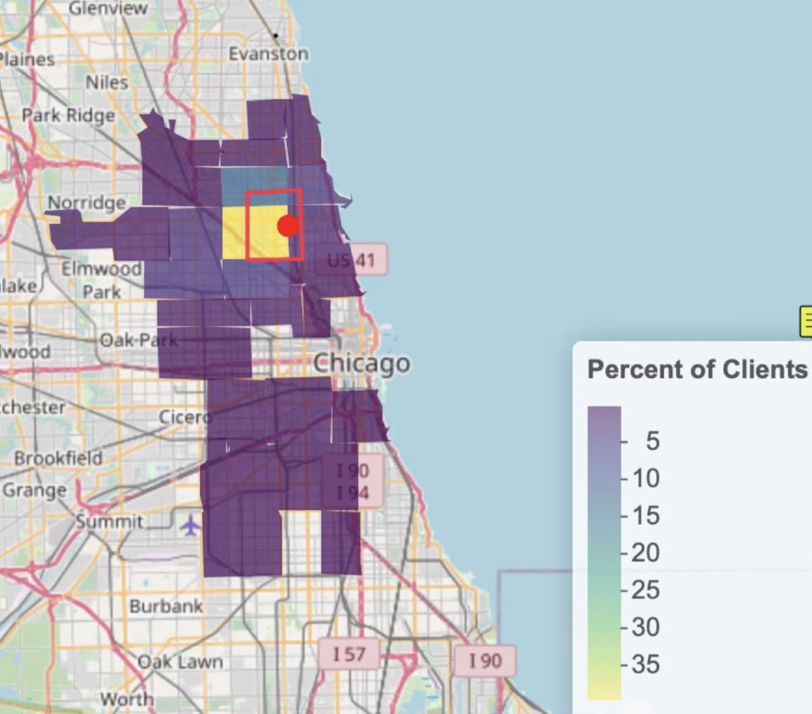
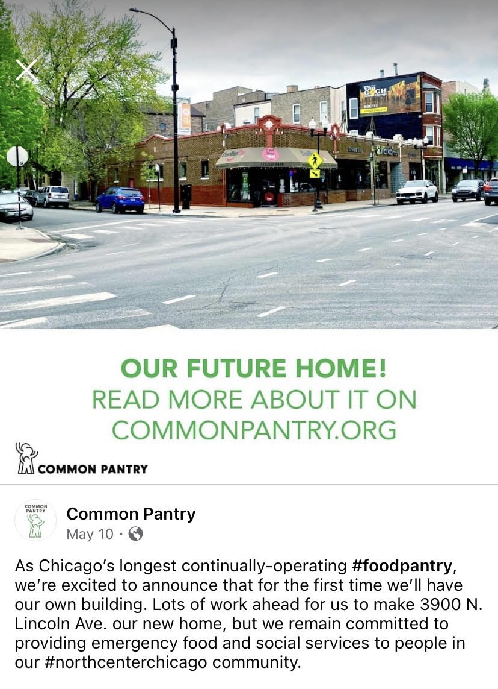
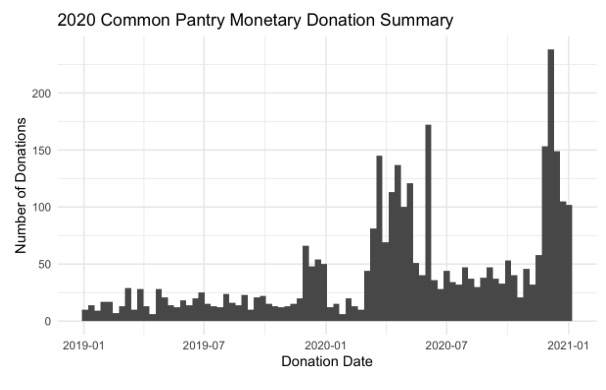
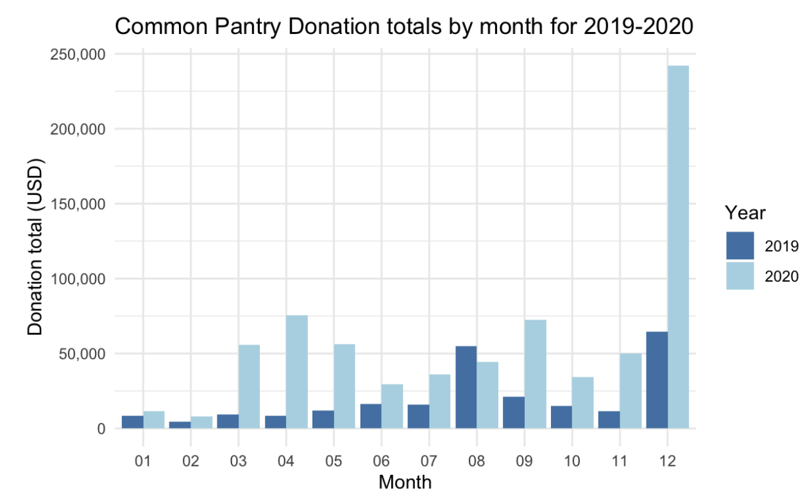
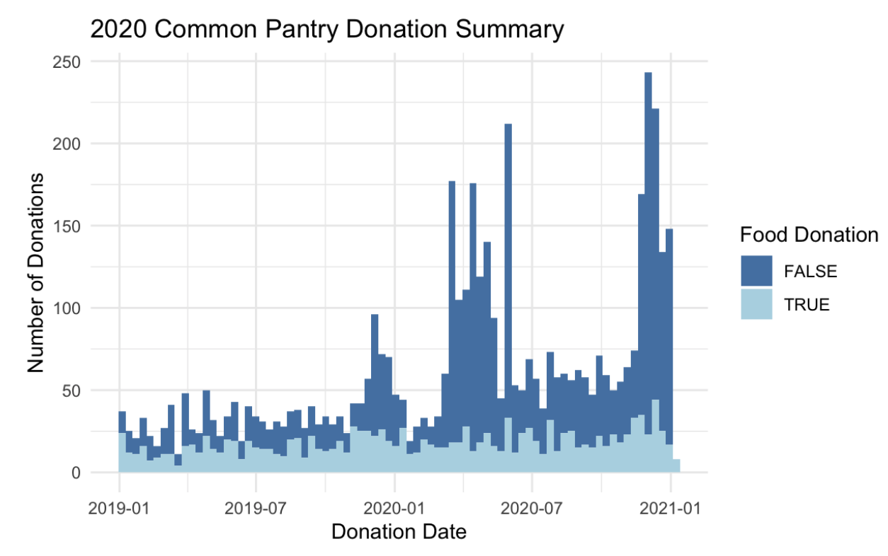

```{r setup, include=FALSE}
knitr::opts_chunk$set(echo = FALSE)
```

#### Brief reflection

During January of 2021 I was fortunate enough to have the opportunity to complete a one credit internship analyzing data with Common Pantry, my local food pantry in Chicago, IL. This internship was very rewarding as not only did I become much more comfortable in R and learn quicker and easier ways to analyze data, but in the process I was able to help out to my local community with information that could play a part of feeding more families in the coming months.

One of my main takeaways from this internship was the importance of good data. As a small nonprofit, a lot of Common Pantry's data entry is done by hand which makes sense. Throughout my analysis, I encountered problems such as mismatched or missing units within the data, inconsistencies with data being recorded as characters or numeric entries, and simply missing information among other issues. This gave me a lot of practice cleaning the data, and learned new techniques to do so including using functions such as  str_replace_all(), str_extract(), as.numeric(), and several others. I also got good practice with joining data sets horizontally and vertically, renaming columns, exporting and importing data from a variety of sources, and more. 

#### Results

When COVID-19 hit in March 2020 and demand at Common Pantry spiked to about 2.11x their normal levels, Common Pantry could understandably no longer collect in depth information on clients such as their names, addresses, family size, and more. However, one piece of information they were able to collect was client zip code. I used this to create a basic density plot of the distribution of clients in Chicago. The Common Pantry service area, outlined in red, was removed once COVID-19 put many out of work. 

{width=55%}

The map above shows an important point, which is that a large portion of Common Pantry's clients during COVID are coming from out of their service area and perhaps this service area needs to be enlarged for the long term (if Common Pantry can get adequate funding to do so). Four months after the conclusion of this project, one super exciting thing to note is that Common Pantry has recently announced the purchase of their own new and larger building only three blocks from the current pantry that will allow them to serve a greater amount of clients! 

{width=55%}

Outside of the zip code analysis, as a result of the limited 2020 data a large portion of my work was done with the 2019-2020 data on the donor appeal instead of information on the clients coming to the pantry. However, I was able to create the following plot which demonstrates the sheer number of clients visiting the pantry each month. Notice the spike in numbers as COVID begins and people are laid off of work in March and April. 

{width=55%}

Thankfully, while much of the community was in need of increased support for the majority of 2020, other members were able to step up and support Common Pantry to a greater level than before. In 2019, Common Pantry received 1,429 total donations, with 55.7% of them being financial. Total donations more than doubled in 2020 at 3,415, with 74.8% being financial. While the average donation amount fell in 2020, it was not by much, falling from 304.23 dollars in 2019 to $275.96 in 2020. For a visual summary of how donations changed throughout 2020 itself, see below.

{width=55%} 

{width=55%}

Another interesting thing I found when investigating the data was that despite monetary donations skyrocketing when COVID-19 hit, food donations stayed relatively constant. This makes sense - in the virtual environment, schools and businesses that may have been doing food drives in 2019 transitioned over to monetary fundraisers. This comparison of food versus monetary donations overtime can be seen below.  

{width=55%}

The remainder of the work I did with Common Pantry is more private, as I identified their top 75 donors of 2019-2020 to better inform them who to potentially thank and/or target for additional funds in the future. I also used R to filter for frequent donors and was able to develop a list of people giving a certain amount monthly. Additionally, I identified some of Common Pantry's most successful appeals and campaigns for raising money (unsurprisingly, the COVID-19 appeal and the I am Your Neighbor fundraisers were incredibly successful). 

#### Conclusion

Overall, I am so happy I got to have this experience and give back in a new way to a group that I have been volunteering with since middle school. It is my hope that as I continue to learn more data science and R that I can help Common Pantry and other nonprofits in ways that I haven't even imagined yet.
