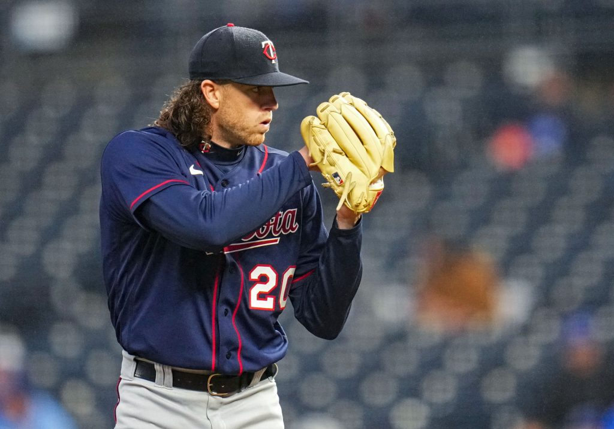

```{r setup, include=FALSE}
knitr::opts_chunk$set(echo = FALSE)
```

{width='70%'}

In Fall 2021 I had the opportunity to take Bayesian Statistics (STAT 454) and complete a capstone project on a topic of choice. Hearing so much about the use of Bayesian techniques in sports, I decided to learn more about career trajectory for pitchers in the MLB, with a focus especially on Tommy John surgery. Please check out [**this website**](https://tjpitchertrajectory.netlify.app/index.html) to learn more and feel free to reach out to me with questions and/or suggestions! 

