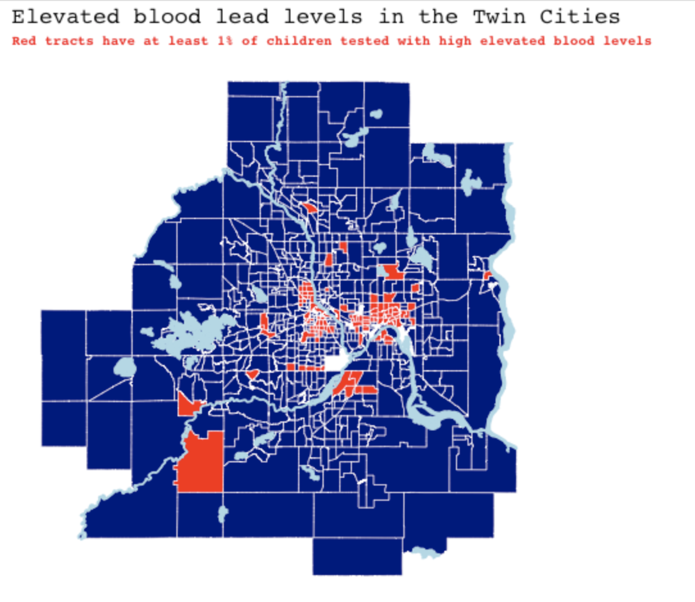

```{r setup, include=FALSE}
knitr::opts_chunk$set(echo = FALSE)
```

{width='70%'}

In Spring 2022 I got to take Correlated Data (STAT 452) and learned about how to work with time series, longitudinal, and spatially correlated data. I enjoyed combining my passion of mapping with modeling techniques that account for spatial correlation in order to learn more about the critical issue of childhood lead exposure in the Twin Cities, which can cause damage to a child's brain and nervous system, slowed growth and development, and even comas or death with severe exposure. To learn more about what might cause elevated blood lead levels in children and where this issue is most apparent, check out [our writeup](https://github.com/efranke22/nick-erin-capstone) on github.


