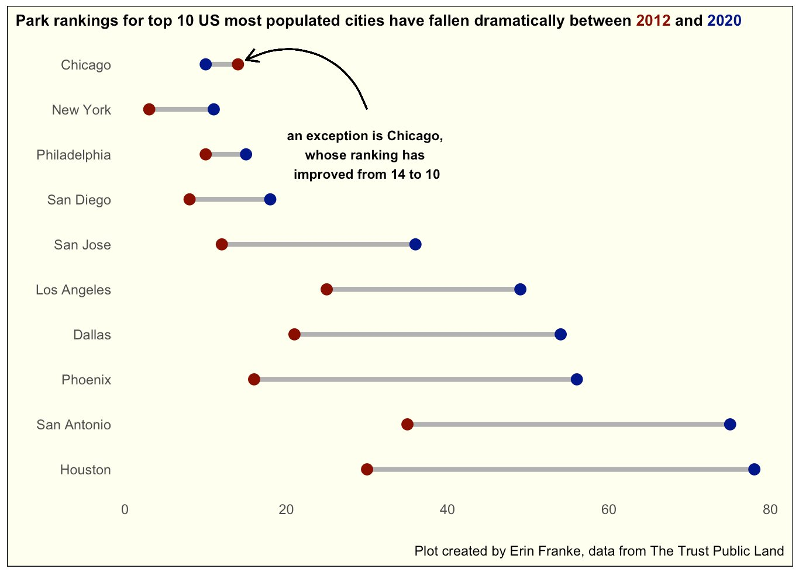
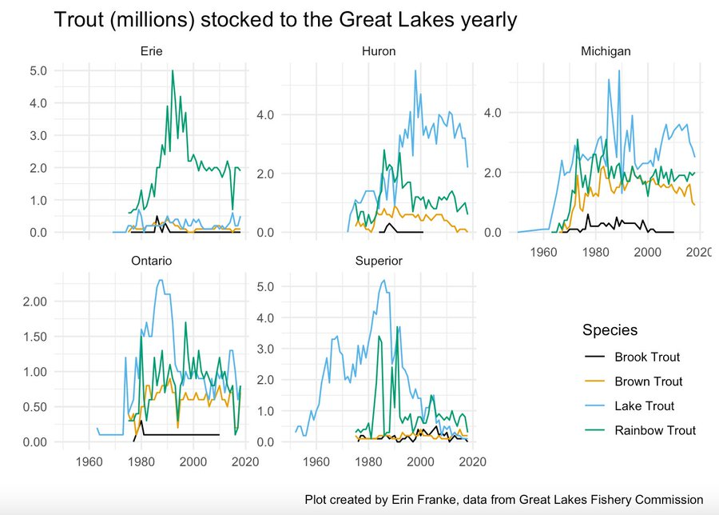
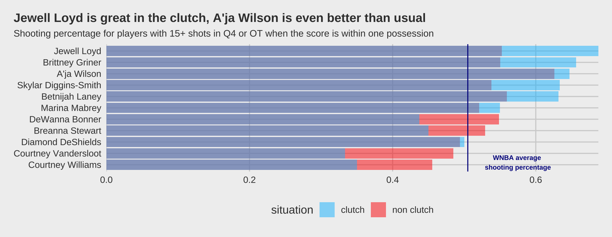
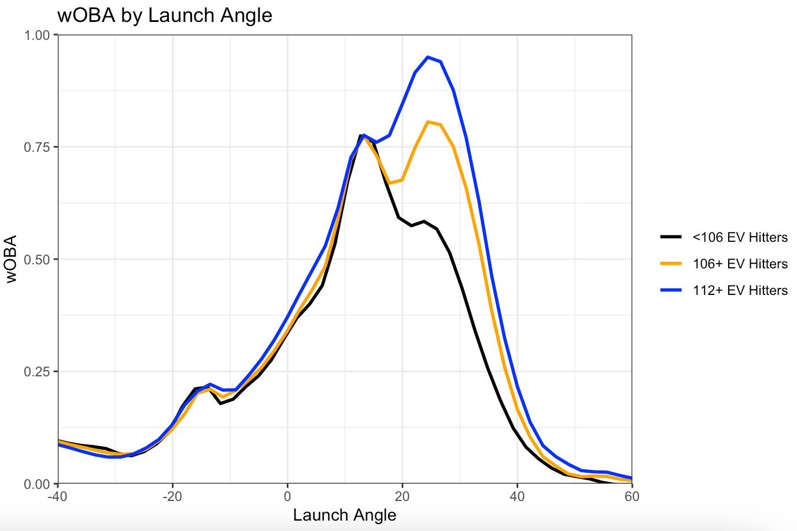
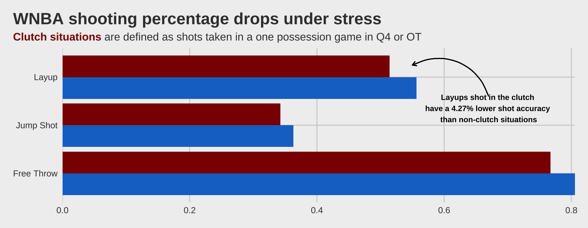
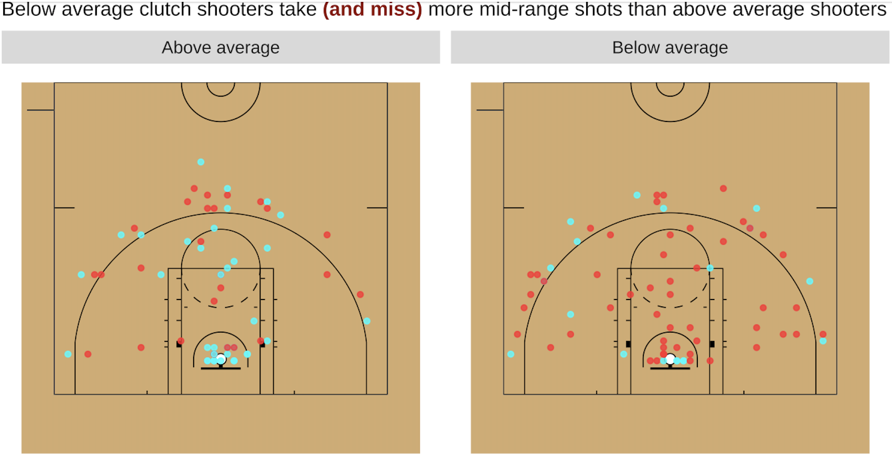

    
```{r setup, include=FALSE}
knitr::opts_chunk$set(echo = TRUE)
```

Here are a collection of some data visualizations I have created starting in May 2021. Some are my favorite visualizations from the EDA portion of larger projects (during which I described where exactly the data were coming from and why), but most are either for the #TidyTuesday project or my own curiosity. Feel free to zoom in on specific graphs for more detail. 

## Tidy Tuesday 
{width=32.5%} {width=32.5%} {width=32.5%}
{width=32.5%} {width=32.5%} {width=32.5%}
{width=64%} {width=35%}

```{r out.width='32%', echo = FALSE}
knitr::include_graphics("images/city_walking.gif")
```

## Sports 

{width=63%} {width=36%}
{width=36%} {width=63%}
{width=63%}
