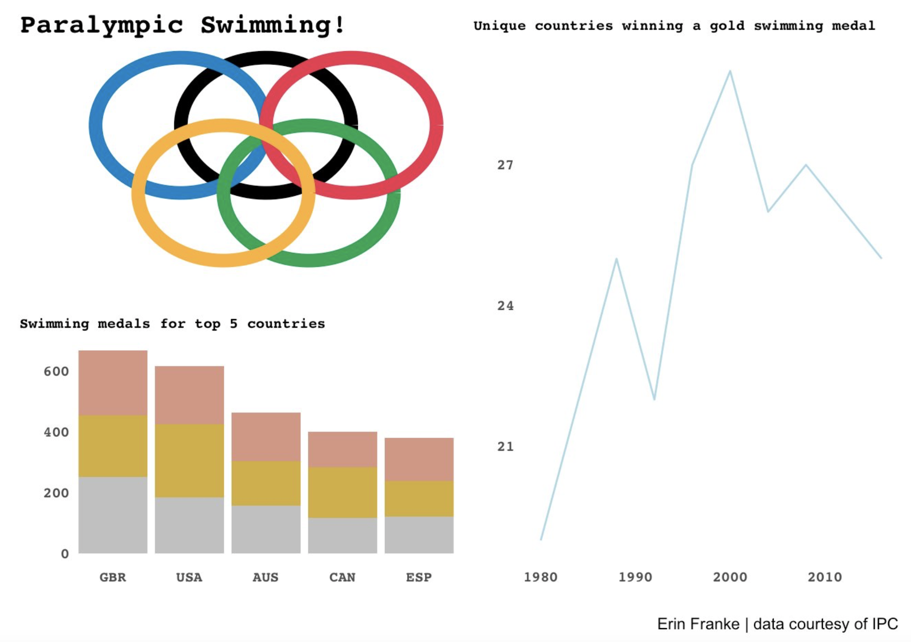
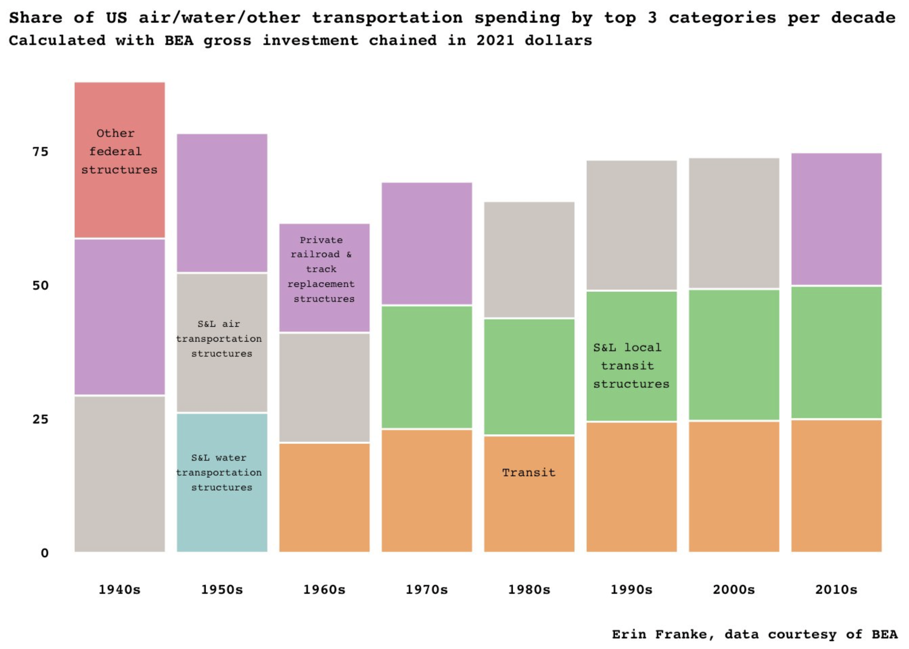
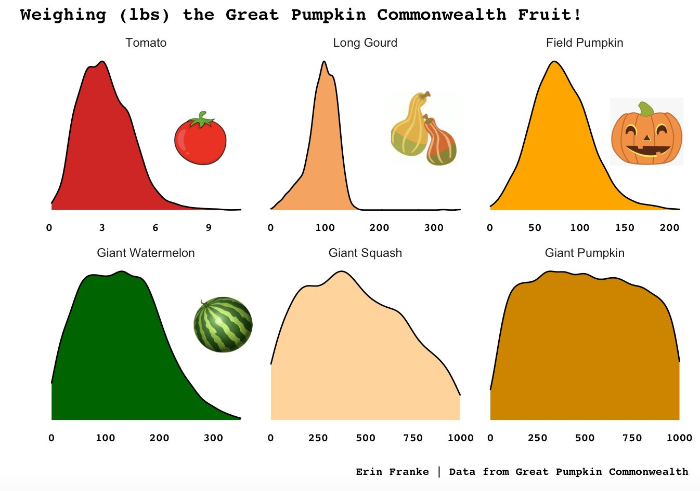
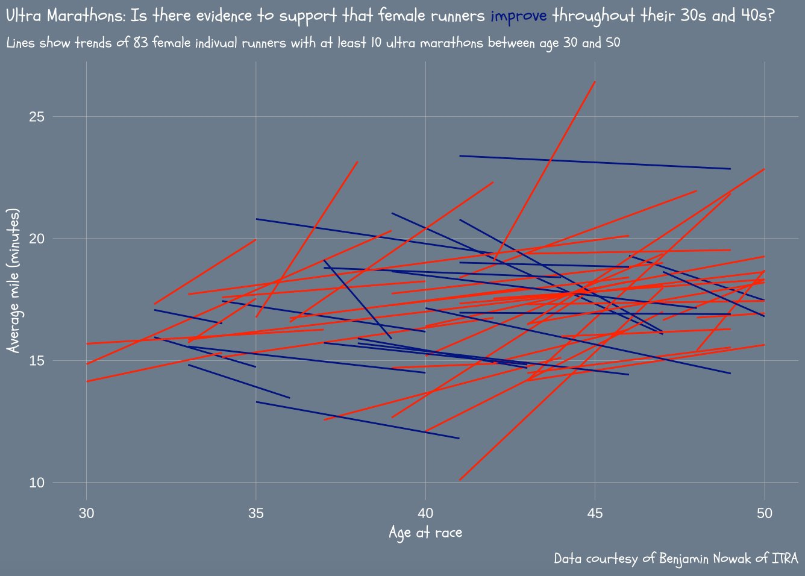
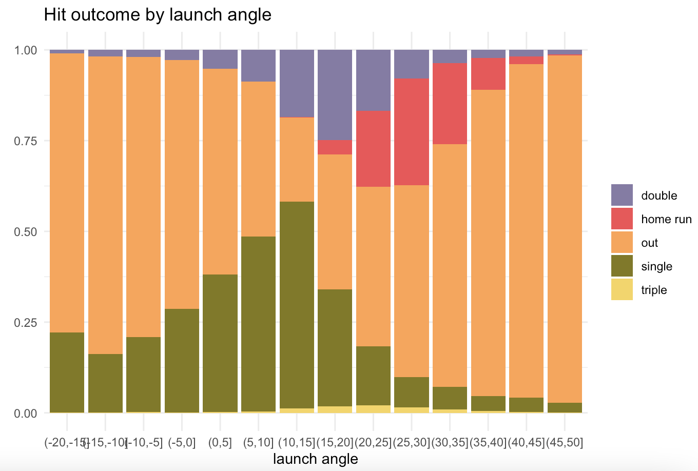
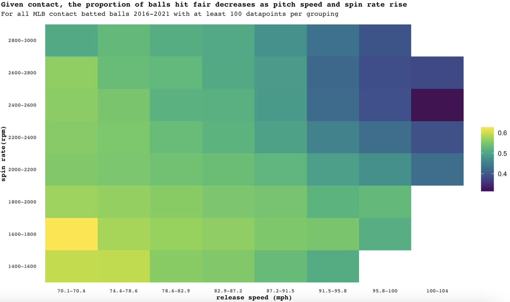
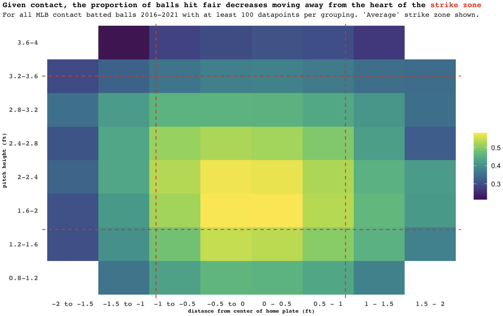
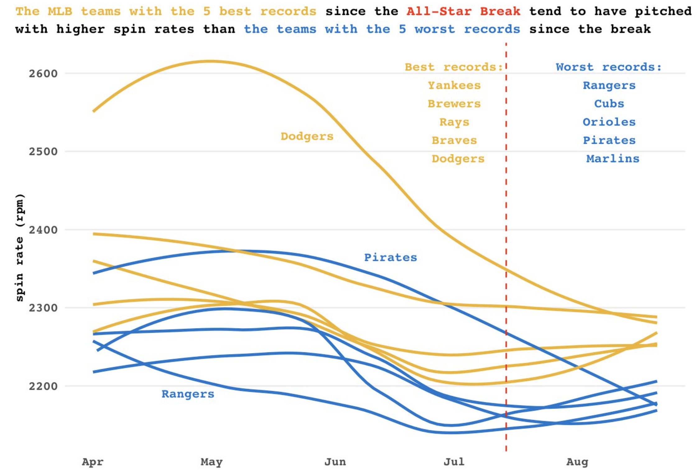
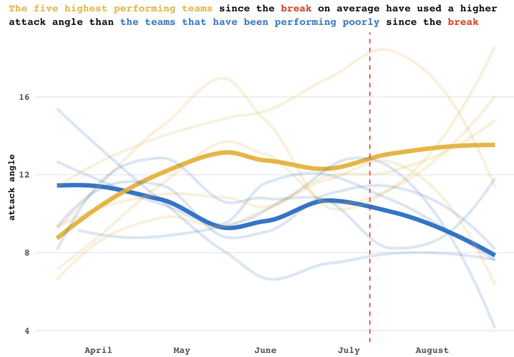

    
```{r setup, include=FALSE}
knitr::opts_chunk$set(echo = TRUE)
```

Here are a collection of some data visualizations I have created starting in May 2021. Feel free to zoom in on specific graphs for more detail. 

## Tidy Tuesday 
{width=32.5%} {width=32.5%} {width=32.5%}
{width=32.5%} {width=32.5%} {width=32.5%}
{width=32.5%} {width=32.5%} {width=32.5%}
{width=32.5%}{width=32.5%}{width=32.5%}

```{r, echo=FALSE,out.width="32%", out.height="20%",fig.show='hold'}
knitr::include_graphics(c("images/city_walking.gif","images/drought_sev_map.gif", "images/lemur_age2.gif"))
```

## Sports 

{width=63%} {width=36%}
{width=36%} {width=63%}
{width=50%} {width=45%}
{width=32%} {width=32%} {width=32%}
{width=33%}
