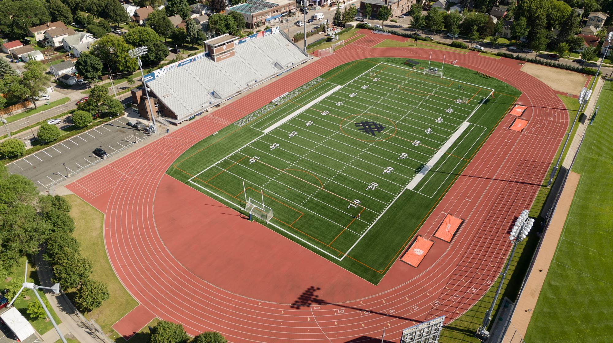

```{r setup, include=FALSE}
knitr::opts_chunk$set(echo = FALSE)

```

## Education

BA in Statistics, *2023* \
[Macalester College](https://www.macalester.edu): Saint Paul, MN

[Northside College Preparatory High School](https://www.northsideprep.org) of Chicago, IL *2015-2019* 

For more information on my education, work, internship, and research experience, please check out [my resume](Erin Franke Resume 2021-2.pdf). 

## A little more about me

In addition to my academics, I also enjoy running distance for Macalester Track & Field and Cross Country, volunteering at my local food pantry in Chicago, hiking, and watching baseball (especially the Twins and Cubs)! 

{width=40%} {width=40%}
{width=40%} {width=40%}

## Contact 
It is easiest to contact me by email at efranke@macalester.edu!


