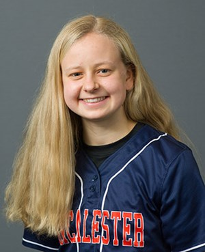

```{r setup, include=FALSE}
knitr::opts_chunk$set(echo = FALSE)

```

{width=40%}

## Education

BA in Applied Mathematics & Statistics and Economics, *2023* \
[Macalester College](https://www.macalester.edu): Saint Paul, MN

[Northside College Preparatory High School](https://www.northsideprep.org) of Chicago, IL *2015-2019* 

## Work and Internship Experience 

**Carnegie Mellon Summer Undergraduate Research Experience in Statistics**\
*Theme of "Data Science in Sports Analytics"*\
*June 1 - July 31, 2021*\

**Introduction to Statistics (STAT 155) Preceptor**\
*Macalester College*\
*January 2021 - present*\

**Data Analysis Internship** \
*Common Pantry of Chicago, IL*\
*January 2021*\

**Introduction to Computer Science (COMP 123) Preceptor**\
*Macalester College*\
*Sep 2020 - Dec 2020*\

## A little more about me

In addition to my academics, I also enjoy playing softball at Macalester, volunteering at my local food pantry in Chicago, running and hiking, and watching baseball (especially the Cubs). 

{width=40%} {width=40%}
{width=40%} {width=40%}

## Contact 
Please reach out to me by email at efranke@macalester.edu!!


